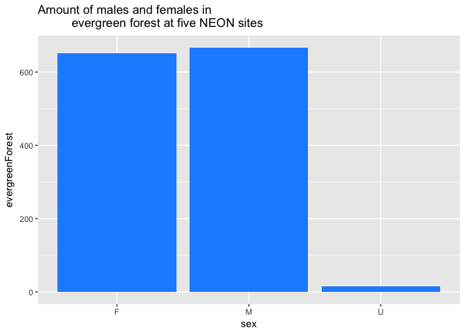
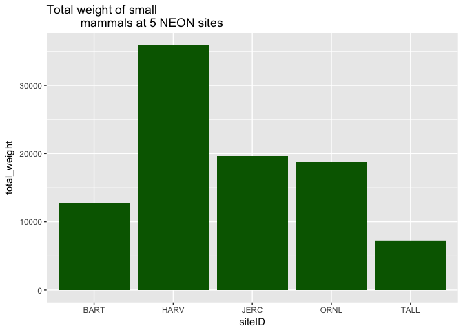

Analysis Report 1: NEON Sites Analysis of Deciduous and Evergreen Forests
================
Courtney Lopez
3/15/2018

Introduction
============

The National Ecological Observatory Network (NEON) is an ecological observation facility that collects data on rapidly changing ecological processes in the United States. NEON has standardized data from 81 field sites that span across the United States within 20 Eco-climatic domains that represent regions of distinct land forms, vegetation, climate, and ecosystem dynamics. NEON measures the causes and effects of environmental change in different types of environments and data sets.

The different types of field sites include core terrestrial sites, core aquatic sites, relocatable terrestrial sites, and relocatable aquatic sites. The different sites ensure that the data will statistically represent ecological, physical, and biological differences spanning the continent. As seen from the image below, the field sites are also in Alaska, Hawaii, and Puerto Rico. This image shows where the NEON sites are located including where the four different types of sites are located.


At the varying sites multiple different functional groups of dry mass are recorded depending the location of the site. This includes dry mass of flowers, leaves, mixed, needles, other, seeds, twigs/branches, and woody material. This project however, focuses on the small mammal box trapping data set, which assess abundance and diversity in North America. This data is the "mark-recapture, demographic, and size data collected by box trapping for small mammals" (i.e., rodents &lt; 600 grams). NEON chose to observe these small mammals as they are common to almost every place and they are receptive to changes in the environment. These small mammals are based on a couple different characteristics including taxonomic, behavior, dietary, and size. This data set recorded for each mammal captured the species identification, size, including length and weight, reproductive capabilities, and other small things in order to identify the species including, blood, ear, hair, whiskers, and fecal samples. This data is important for in the use of public health issues like disease prevalence, accounting for the amount of species that are in certain environments, and specifically for climate changes and land use. (<http://www.neonscience.org>)

The small mammal data that I will be focusing on for this analysis are the sites that contain both deciduous forest and evergreen forest. Specifically, I will be focusing on the sites Bartlett Experimental Forest (BART), Harvard Forest (HARV), Jones Ecological Research Center (JERC), Oak Ridge (ORNL), and Talladega National Forest (TALL). I also chose to look at the difference in sex and weight of the small mammals, between the two forests at each of the five NEON sites. My hypotheses are the abundance and size of the small mammals will be larger in the evergreen forests than in the deciduous forests. I am also curious to find out which of the five NEON sites contains more small mammals and their differences in abundances between the two forests at each site. These proposed explanations were made based on the conclusions supplied by other research articles.

Forests supply a habitat and home for many different species including plants and animals. There is a difference between the different types of forests and especially the ones looked at in the data set being analyzed: evergreen and deciduous forests. Evergreen trees/plants do not shed their leaves, while deciduous trees/plants lose their leaves in autumn. This is usually during the winter and dry season. One of the most distinguishing characteristics that is measured is leaf mass per area (LMA). "In deciduous forests, there is similarity between plastic and evolutionary responses of LMA to light gradients. In evergreens, however, LMA is lower in shaded than sunlit individuals of the same species, whereas shade-tolerant evergreens have higher LMA than light-demanders grown under the same conditions" (Lusk et al. 2008). This shows the different demands that are brought about in these two different environments of forests. Therefore, the animals at these sites have to have a variations in their diets, which contributes to their weight. One research articles explains, "deciduous...forests form a complex habitat mosaic rich in small mammals. The configurations of these habitats...that reside therein, make the deciduous forest ecosystem unique" (Ceballos 1990).

Many factors contribute to the abundance of small mammals in forests. One study looked at small mammal abundance in a managed forest. Some of the NEON sites are also managed. This study looked at an industrial forest in New Brunswick with the small mammals of voles, shrews and mice. They wanted to conclude whether or not small mammal abundance was affiliated with landscape context. This study proved that most species abundance correlate with vegetation, and landscape management was not (Bowman et al. 2001). This helps us understand that there should not be a difference in the abundance of mammals between the NEON sites that have managed forests and those that do not. The only thing that should affect their abundance and ultimately weight is their availability for resources.

Another factor that influences the abundances of small mammals in both deciduous and evergreen forests is the chemicals in the environment. One study looked at Carbon isotope ratios like carbon-13 in both evergreen and deciduous forests and how this affects vegetation, soils, and the canopy air. The measurements were taken over two growing season and about five strands of the forest ecosystem was recorded by using leaf area index (LAI). The results concluded that the carbon-13 leaves in the evergreen forest did not differ in vegetation, while the deciduous strands showed a decreasing carbon-13 value in vegetation (Buchmann et al. 1997). This shows that deciduous forests have a more varied environment throughout their growing season.

The fragmentation of these forests not only affects these animals abundances, but their diversity as well. According to a research article looking at a forest role in maintaining small mammal abundance and diversity in an Atlantic forest landscape, the loss of habitat results in a less abundant small animal communities (Pardini et al. 2005). This shows that evergreen forests may contain more animals in that the leaves stay on their trees all year around. Another research article that also looked at fragmentation and wildlife in evergreen forests concluded that fragmentation interacts with other pressures in the environment to reduce diversity of mammals (Pattanavibool and Dearden 2002). A conflicting research article, reviews other previous studies about small mammal community change after clear-cutting temperate forests. This article proves that there is a positive pattern of the responses of small mammals to the cutting of the forests (Kirkland Jr 1990). With this information, it will be interesting to find the abundance of small mammals between the two types of forests.

Temperature gradient can also affect body size distributions of small mammals. A research article looked at temperature to determine species richness in different habitats. This study used small mammals from 23 communities of rodents samples from the NEON data. They determined that temperature determines the community-wide niche space that a species can occupy, which in turn alters the abundance of the species (Read et al. 2018). Also, there seems to be an expansion towards the tropics that will increase diversity. This article helps understand what the difference of species diversity might be in the case of the varying temperatures of evergreen and deciduous forests. The size difference between males and females are also a contributing factor to the habitat they live in. According to a research article looking at mammals in which females are larger than males, "Females are larger than males in more species of mammals than is generally supposed" (Ralls 1976). Also, the selective pressure that favors larger females than male mammals is the result from being a better fit mother. With this conclusion I wonder if this finding will hold true to evergreen and deciduous forest small mammal females.

Understanding this data is important because it can be used by scientists, researchers, professors, and students to gain knowledge about ecological differences between different environments on recent ongoing data collection. "NEON will provide users with the data necessary to address large‐scale questions, challenge current ecological paradigms, and forecast ecological change" (Kao et al. 2012).

(<http://www.neonscience.org>)

Methods
=======

This data came from the NEON database for the Terrestrial Observation System (TOS) for small mammal sampling. The traps are placed at all terrestrial sites, except for Hawaii. These small mammals were captured using Sherman live traps about (3" x 3.75" x 9-12") in size and Tomahawk traps. One hundred of the Sherman traps are laid out within 10 m of spacing, in 10 rows and 10 columns making it 100 traps per grid. There is a total of up to 8 grids set for each sampling period. These traps are set with bait containing a seed mixture of 35% sunflower seeds and 65% millet. For two other sites, traps with "bait balls" were set containing oatmeal, peanut butter, and vanilla extract. When captured, the small mammals were processed in the field in order for them to released quickly and to obtain the necessary data being collected.

The sites I will be focusing on are the Bartlett Experimental Forest (BART), Harvard Forest (HARV), Jones Ecological Research Center (JERC), Oak Ridge (ORNL), and Talladega National Forest (TALL). These are the five sites I chose to analyze because they are the only sites that contained two types of forests, evergreen and deciduous forests. BART is a relocatable terrestrial site in New Hampshire that is primarily deciduous and 30% of the site is managed. HARV is a core terrestrial site in Massachusetts that represents many habitats including northern, transition, and central forests; marshes, swamps, conifers, and forest plantations. JERC is a relocatable terrestrial site in Georgia with Lower Coastal Plains and Flatwoods. ORNL is a core terrestrial site in Tennessee within the Appalachians and Cumberland Plateau. TALL is also a core terrestrial site in Alabama that consists of the Talladega National Forest. It is mostly Gulf Coastal Plain and Appalachian foothills. I will be analyzing these sites by comparing the sex and weight differences between the evergreen and deciduous forests located at each site.

Results
=======

``` r
#load packages needed for any analysis
library("knitr")
library("dplyr")
```

    ## 
    ## Attaching package: 'dplyr'

    ## The following objects are masked from 'package:stats':
    ## 
    ##     filter, lag

    ## The following objects are masked from 'package:base':
    ## 
    ##     intersect, setdiff, setequal, union

``` r
library("readr")
library("ggplot2")
library("tidyr")
```

``` r
# use readr package function read_csv to load in the small
# mammals big dataset

small_mammal_data <- readr::read_csv("data/raw_data/mam_pertrapnight.csv")
```

    ## Parsed with column specification:
    ## cols(
    ##   .default = col_character(),
    ##   decimalLatitude = col_double(),
    ##   decimalLongitude = col_double(),
    ##   coordinateUncertainty = col_double(),
    ##   elevation = col_double(),
    ##   elevationUncertainty = col_double(),
    ##   collectDate = col_date(format = ""),
    ##   hindfootLength = col_integer(),
    ##   earLength = col_integer(),
    ##   tailLength = col_integer(),
    ##   weight = col_integer()
    ## )

    ## See spec(...) for full column specifications.

``` r
# we would like to get only thr rows that have captured
# animals in the trap and get the count of each
# sex in each site that are in deciduous
# and evergreen forests
  
forests_filter_data <- small_mammal_data %>%
  filter(trapStatus == "5 - capture") %>%
  filter(nlcdClass %in% c("deciduousForest", "evergreenForest")) %>%
  group_by(siteID, sex, nlcdClass) %>%
  tally() %>%
  spread(nlcdClass, n) %>%
  mutate(num_forest_types = sum((deciduousForest > 0) +
        (evergreenForest > 0), na.rm = TRUE)) %>%
  filter(num_forest_types == 2)
```

``` r
# create boxplot between number of individuals
# (sex) in deciduous forests

ggplot(data = forests_filter_data,
       aes(x = sex, y = deciduousForest)) +
  geom_boxplot() +
  ggtitle("Amount of males and females in
          deciduous forest at five NEON sites") +
  geom_col(fill = "red")
```


``` r
# create boxplot between number of small mammals
# captured at each siteID in deciduous forest

ggplot(data = forests_filter_data,
       aes(x = siteID, y = deciduousForest)) +
  geom_boxplot() +
  ggtitle("Amount of small mammals in deciduous
          forest at five NEON sites") +
  geom_col(fill = "red")
```


``` r
# create boxplot between number of individuals
# (sex) in evergreen forests

ggplot(data = forests_filter_data,
       aes(x = sex, y = evergreenForest)) +
  geom_boxplot() +
  ggtitle("Amount of males and females in
          evergreen forest at five NEON sites") +
  geom_col(fill = "dodger blue")
```



``` r
# create boxplot between number of small mammals
# captured at each siteID in evergreen forest

ggplot(data = forests_filter_data,
       aes(x = siteID, y = evergreenForest)) +
  geom_boxplot() +
  ggtitle("Amount of small mammals in evergreen
          forest at five NEON sites") +
  geom_col(fill = "dodger blue")
```


``` r
# filter out sites that contain both evergreen
# and deciduous forest
# and summarise the total weight

weight_data <- small_mammal_data %>% 
  filter(trapStatus == "5 - capture") %>%
  filter(siteID %in% c("BART", "HARV", 
                       "JERC","ORNL", "TALL")) %>%
  group_by(siteID, sex) %>%
  summarise(total_weight = sum(weight, na.rm = TRUE))
```

``` r
# create a boxplot with the 5 NEON
# siteIDs versus the weight

ggplot(data = weight_data,
       aes(x = siteID, y = total_weight)) +
  geom_boxplot() +
  ggtitle("Total weight of small
          mammals at 5 NEON sites") +
  geom_col(fill = "dark green")
```



``` r
# create a boxplot with the sex versus the weight

ggplot(data = weight_data,
       aes(x = sex, y = total_weight)) +
  geom_boxplot() +
  ggtitle("Total weight of small
          mammals of each sex") +
  geom_col(fill = "dark green")
```


Discussion
==========

The results found from the created box plots showed very interesting data. My hypothesis was that the abundance and size of the small mammals will be larger in the evergreen forests than in the deciduous forests. I was also curious to find out which of the five NEON sites contained more small mammals and their differences in abundances between the two forests at each site. The first box plot showed that there is more males than females in the deciduous forests (shown in red) at all the five sites. There are about 950 females to 1,100 males. The second box plot split the five NEON sites in the deciduous forests and concluded that the HARV site has a significantly higher abundance of small mammals than BART, JERC, ORNL, and TALL. The site that had the least amount of small mammals captured in the deciduous forest was JERC. The third box plot looked at the difference in abundance of sex in evergreen forest (shown in blue). This box plot showed little difference to the amount of males and female small mammals present in evergreen forests between the five NEON sites. Both male and females had about 650 small mammals in the evergreen forest. The fourth box plot split the five NEON sites in the evergreen forests and concluded that the HARV site has a lot more small mammals than the other four sites. BART and ORNL had the least amount of small mammals. The fifth box plot looked at the total weight of the small mammals between the five different NEON sites. HARV had the highest total weight, followed by JERC, ORNL, BART, then TALL. Lastly, the final box plot showed that the total combined weight of males is more than females.

According to the data found, my hypothesis was rejected. By tallying the amount of small mammals in deciduous forest to the amount in evergreen forests, the amount of small mammals in the deciduous forest is a lot more (~2,000 to 1,200) than in the evergreen forest. Also there are a lot more males than females in both forest types. Another finding was that the HARV site contained a significant higher amount of small mammals in both forest types than the other four NEON sites. As mentioned before, HARV is a core terrestrial site in Massachusetts that represents many habitats including northern, transition, and central forests; marshes, swamps, conifers, and forest plantations. Since there are many different habitats that coincide at this side, we can assume this is why the abundance of small mammals is higher. The vegetation at this site is regenerating Eastern Deciduous temperate forest. Deciduous trees are adapted to tolerate cold and dry weather conditions, so this might account for many of the small mammals staying and using the resources from these deciduous trees. Plus, it is known that the nutrient requirements of evergreen forests are higher than deciduous trees.

The vegetation at the BART site includes Easter Deciduous, coreal ecotone. The vegetation at JERC is a mix of Longleaf Pine, Oaks, and wiregrass with a number of perennial grasses. This site can have the least number of animals captured since there is no forest vegetation type. The ORNL site has a vegetation of a mixture of oak and patches of pine with a a deciduous forest of different types of oaks. The vegetation of the TALL site is mostly different forests types and wetlands. The vegetation at these sites were primarily deciduous, so this could have also affected the skew of the data. The weather at these locations can also affect where these small mammals decide to locate and stay at. The small mammals dynamics include interactions with the habitat nutrients and plant species. Population can grow exponentially when conditions are favorable, but exponential growth cannot continue indefinitely. This can be true for the HARV site. For further research, it would be best to look at the different species captured between the two forests and the weather differences between the various sites.

Sources Cited
=============

Bowman, J., G. Forbes, and T. Dilworth. 2001. Landscape context and small-mammal abundance in a managed forest. Forest Ecology and Management 140:249–255.

Buchmann, N., W.-Y. Kao, and J. Ehleringer. 1997. Influence of stand structure on carbon-13 of vegetation, soils, and canopy air within deciduous and evergreen forests in utah, united states. Oecologia 110:109–119.

Ceballos, G. 1990. Comparative natural history of small mammals from tropical forests in western mexico. Journal of Mammalogy 71:263–266.

Kao, R. H., C. M. Gibson, R. E. Gallery, C. L. Meier, D. T. Barnett, K. M. Docherty, K. K. Blevins, P. D. Travers, E. Azuaje, Y. P. Springer, and others. 2012. NEON terrestrial field observations: Designing continental-scale, standardized sampling. Ecosphere 3:1–17.

Kirkland Jr, G. L. 1990. Patterns of initial small mammal community change after clearcutting of temperate north american forests. Oikos:313–320.

Lusk, C. H., P. B. Reich, R. A. Montgomery, D. D. Ackerly, and J. Cavender-Bares. 2008. Why are evergreen leaves so contrary about shade? Trends in Ecology & Evolution 23:299–303.

Pardini, R., S. M. de Souza, R. Braga-Neto, and J. P. Metzger. 2005. The role of forest structure, fragment size and corridors in maintaining small mammal abundance and diversity in an atlantic forest landscape. Biological conservation 124:253–266.

Pattanavibool, A., and P. Dearden. 2002. Fragmentation and wildlife in montane evergreen forests, northern thailand. Biological Conservation 107:155–164.

Ralls, K. 1976. Mammals in which females are larger than males. The Quarterly Review of Biology 51:245–276.

Read, Q. D., J. M. Grady, P. L. Zarnetske, S. Record, B. Baiser, J. Belmaker, M.-N. Tuanmu, A. Strecker, L. Beaudrot, and K. M. Thibault. 2018. Among-species overlap in rodent body size distributions predicts species richness along a temperature gradient. Ecography.
